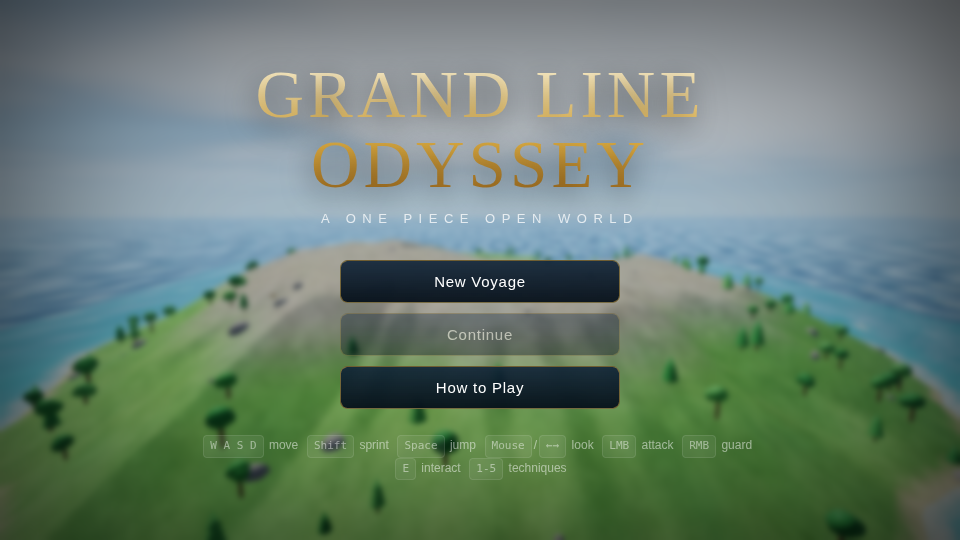
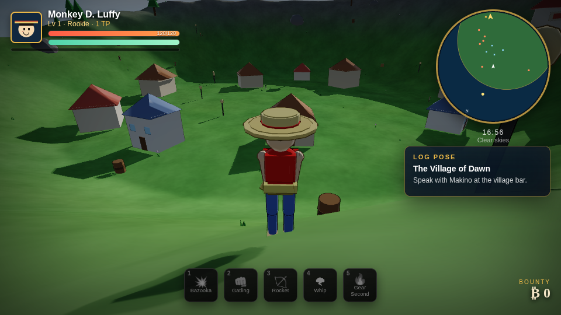
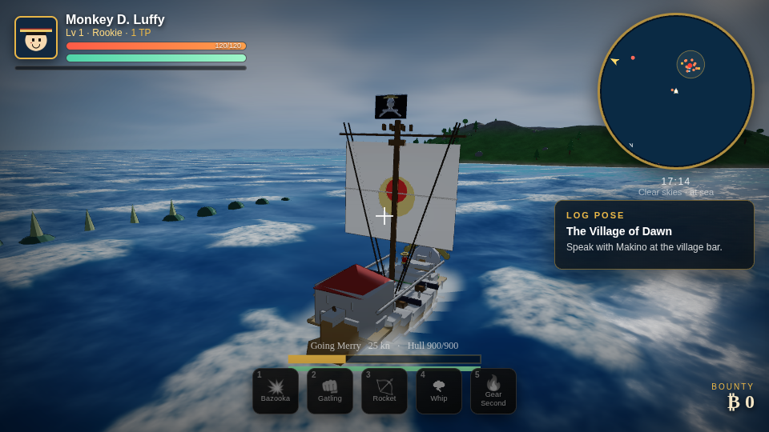
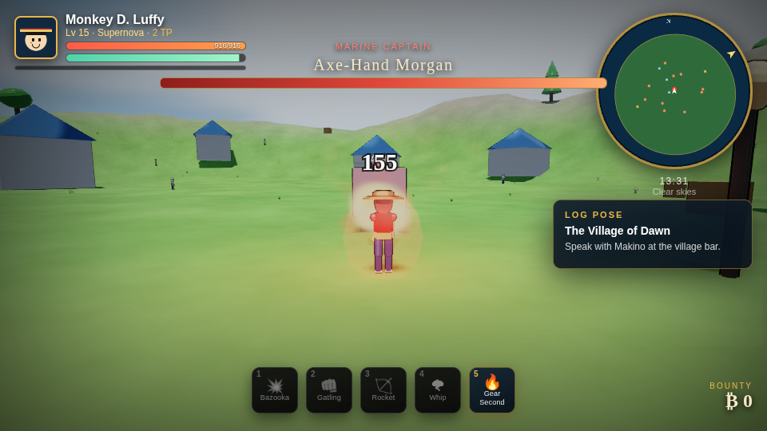
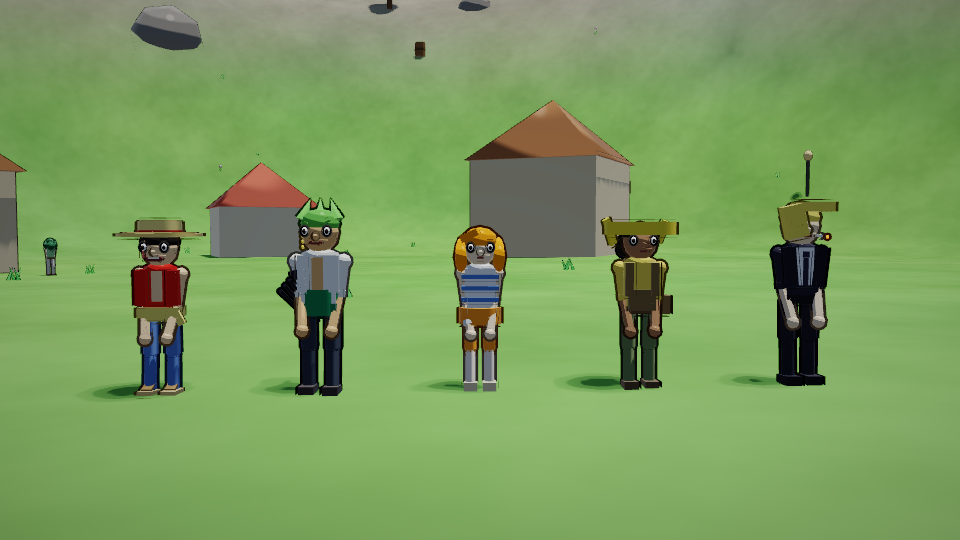
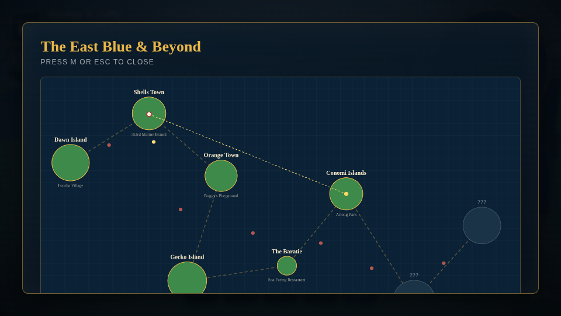

# Grand Line Odyssey

An open-world One Piece action RPG that runs in a browser tab. You start as Monkey D. Luffy
on the day he leaves Foosha Village — one straw hat, one rubber body, one rowboat — and sail
the East Blue island by island, recruiting the crew and growing from a nobody into a pirate
with a bounty.

Everything is one self-contained HTML file. No build step, no dependencies, no assets to
download: the terrain, the ocean, the characters, the music and the sound effects are all
generated by code at runtime.



## Play

```
open grand-line-odyssey/index.html      # macOS
xdg-open grand-line-odyssey/index.html  # Linux
```

Or just double-click `index.html`. It needs a WebGL2 browser (Chrome, Edge, Firefox, Safari 15+).
First load takes a second or two while the eight islands are generated.

## Controls

| Input | Action |
| --- | --- |
| `W A S D` | Move (on foot) / throttle and steer (at sea) |
| Mouse or `← →` | Look around (click the canvas to capture the mouse) |
| `Shift` | Sprint |
| `Space` | Jump / drop anchor |
| `Ctrl` | Dodge roll (brief invulnerability) |
| `LMB` | Attack — three-hit combo, the third is a Gum-Gum Pistol / fire cannons at sea |
| `RMB` | Guard (with Gum-Gum Balloon, a last-moment guard reflects the blow) |
| `1`–`5` | Techniques: Bazooka, Gatling, Rocket, Whip, Gear Second |
| `E` | Talk, open chests, board ship, go ashore |
| `R` | Eat meat (heals, restores stamina) |
| `M` `C` `K` | World map, crew, technique tree |
| `P` | Music on/off |
| `Esc` | Pause / save |

## What's in it

**A continuous ocean world.** Eight procedurally generated islands sit in one 11 km × 5 km sea
with no loading screens between them. Gerstner-wave water with sun glitter, surf that breaks on
the actual coastline (driven by a world depth map), a 22-minute day/night cycle, and weather
that rolls between clear, overcast, rain and storm — storms visibly raise the swell.



**Sailing.** Press `E` at your boat to take the helm. You start with a dinghy and earn the
Going Merry after Syrup Village. Enemy Marine and pirate ships patrol the sea lanes, close to
broadside range and trade cannon fire; sea kings surface in open water. Ships pitch and roll on
the real wave surface.



**Combat.** A three-hit combo that finishes with a stretched Gum-Gum Pistol, five unlockable
techniques, a dodge roll, a guard with a reflect window, hitstop, screen shake and knockback.
Enemies telegraph their attacks; bosses have a second phase at 50% health and their own move
sets — Morgan's axe shockwave, Buggy's chop-chop teleports and knife fans, Kuro's Out-of-the-Bag
dash storm, Krieg's armour and MH5 gas, Arlong's tooth-gun barrage, Smoker's intangible smoke.



**Progression.** XP and levels, technique points spent in a skill tree (five techniques plus six
passives), a bounty that rises as you beat captains, berries from chests and defeated crews,
purchasable stat upgrades in Loguetown, and a Log Pose that always points at your objective.

**A crew you can tell apart at a glance.** Zoro, Nami, Usopp and Sanji join across the story.
They flank you, fight on their own, can be knocked down and get back up, stand on the deck when
you sail, and each grants a passive bonus (Usopp reloads cannons faster, Sanji cooks between
fights, and so on).



Every character is built from primitives with their own signature parts: Luffy's straw hat, open
vest and scar; Zoro's three-spike green hair, haramaki and the three sheathed swords on his hip
(one only comes out when he swings); Nami's striped shirt and Log Pose; Usopp's long nose,
bandana, overalls and satchel; Sanji's suit, curled brow and cigarette. The bosses read the same
way — Morgan's axe arm and steel jaw, Buggy's clown hat and red nose, Kuro's claws and
spectacles, Krieg's spiked gold armour, Arlong's saw nose and shark teeth, Smoker's twin cigars
and jitte.

**Devil Fruit weakness.** Luffy sinks. Fall into deep water and you lose control, take damage,
and have to be dragged out — a crew pulls you out faster than the tide does.



## The voyage

| Chapter | Island | Boss | Reward |
| --- | --- | --- | --- |
| 1 | Dawn Island — Foosha Village | mountain bandits | your first boat |
| 2 | Shells Town | Axe-Hand Morgan | Zoro joins |
| 3 | Orange Town | Buggy the Clown | Nami joins |
| 4 | Gecko Island — Syrup Village | Captain Kuro | Usopp joins, the Going Merry |
| 5 | The Baratie | Don Krieg | Sanji joins |
| 6 | Conomi Islands — Arlong Park | Arlong | your first real bounty |
| 7 | Loguetown | Captain Smoker | the road out of the East Blue |
| 8 | Reverse Mountain | the Gate Sea King | the Grand Line |

Saves are automatic every 45 seconds into `localStorage`, plus a manual save from the pause menu.

## How it's built

`index.html` is a single ~5,600-line file with a purpose-built WebGL2 engine inside it:

- **Renderer** — a deferred-lit-looking forward pipeline in ten GLSL programs. Every prop,
  character, ship and limb is drawn from six primitives batched into a handful of instanced draw
  calls; a typical frame collects ~1,300 instances in about 0.6 ms of CPU time.
- **Shadows** — a 2048² directional shadow map, fitted to the play area each frame and snapped to
  whole texels so the edges don't crawl, sampled with 3×3 hardware PCF and faded out at the map
  border. Front-face culling plus a polygon offset keeps it free of acne and peter-panning.
- **Anime shading** — a soft three-tone cel ramp instead of smooth lambert, a tight specular
  band, a fresnel rim, and ink outlines drawn as expanded back-face shells whose thickness stays
  constant on screen and fades out with distance.
- **Lighting** — analytic sun by day and a real moon key light after dusk, hemispheric ambient,
  and up to eight dynamic point lights gathered per frame for lamp posts, the lighthouse, poison
  clouds, ship lanterns and Gear Second's steam.
- **Post** — the scene renders into a 4× MSAA half-float target, resolves, then runs a bright
  pass, a separable two-iteration bloom, crepuscular rays traced toward the sun, an ACES tone
  map, saturation, a night-vision desaturation curve and a vignette.
- **Quality** — Low / Medium / High presets (shadow resolution, MSAA, bloom) chosen automatically
  from the running frame time, and overridable from the pause menu.
- **World** — seeded value-noise fbm builds each island's 145 × 145 heightmap with a wobbled
  coastline, biome-coloured vertices with baked ambient occlusion, and a scattered prop set with
  collision volumes. A 1536 × 768 depth texture of the whole world feeds the ocean shader so
  wave damping, shallow-water colour and surf line up with the real shoreline. Shallow water is
  alpha-blended so the sand reads through it, the sea floor gets animated caustics, and foliage
  bends under a wind field that strengthens with the sea state.
- **Characters** — no imported models. Every character is a small transform hierarchy of boxes,
  cylinders and low-poly spheres, posed each frame by a procedural animation state machine
  (idle, walk, run, attack, hurt, guard, downed). Luffy's arms literally stretch by scaling the
  limb segments. One shared rig covers proportions, faces and clothing; each character then adds
  a `detail()` pass that hangs their signature parts off the rig's own bone matrices.
- **Ships** — hulls are built from tapered planks with a sheer line that rises fore and aft, a real
  draft so they sit *in* the water, a painted waterline and billboarded foam along it. Each vessel
  has its own character: the Going Merry's sheep figurehead, front lawn and straw-hat sail; the
  Marines' white hull, ram and seagull ensign; the pirates' skull prow and gun ports; the starter
  dinghy's oars.
- **Audio** — WebAudio only. Sound effects are synthesised oscillators and filtered noise; the
  soundtrack is a generative sequencer with per-context scales and tempos that switches between
  village, sailing, battle and boss music.
- **Sky and time** — analytic sun position, a colour-graded palette per time of day, procedural
  clouds and stars, exponential fog tinted toward the sun, and an ACES-style tone map.

## Notes

This is an unofficial, non-commercial fan project. One Piece and its characters are © Eiichiro
Oda / Shueisha. No art, audio or text from the series is included — every asset here is
generated by the code in this repository.
