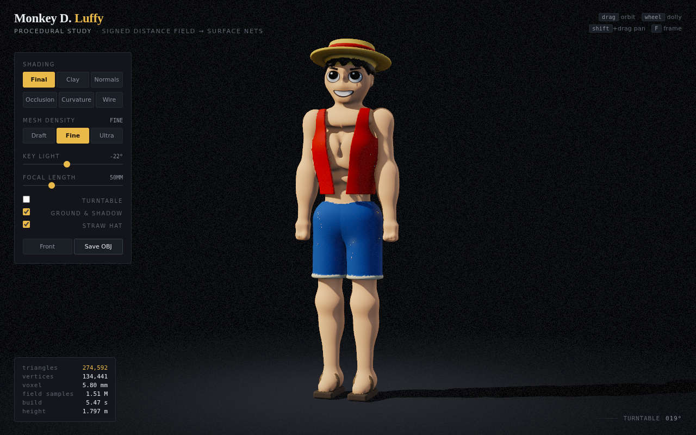
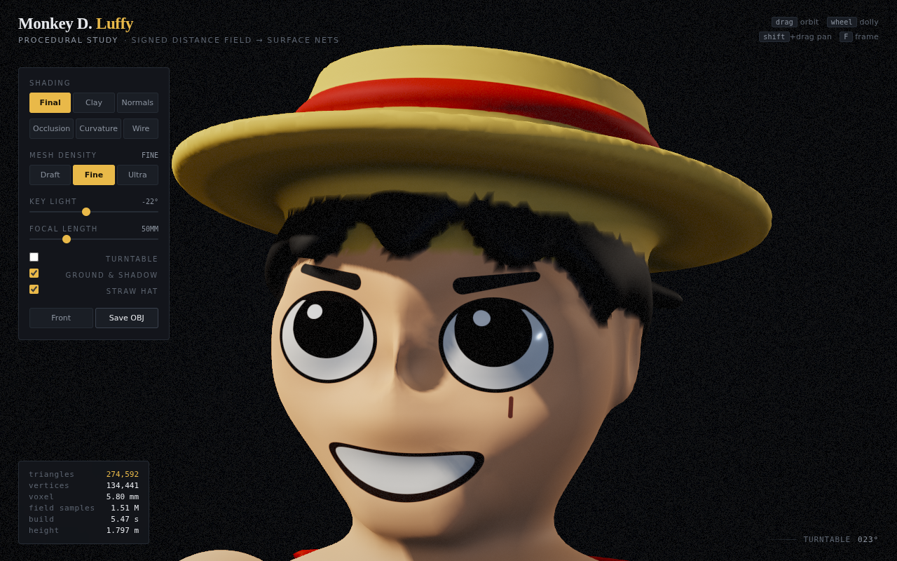
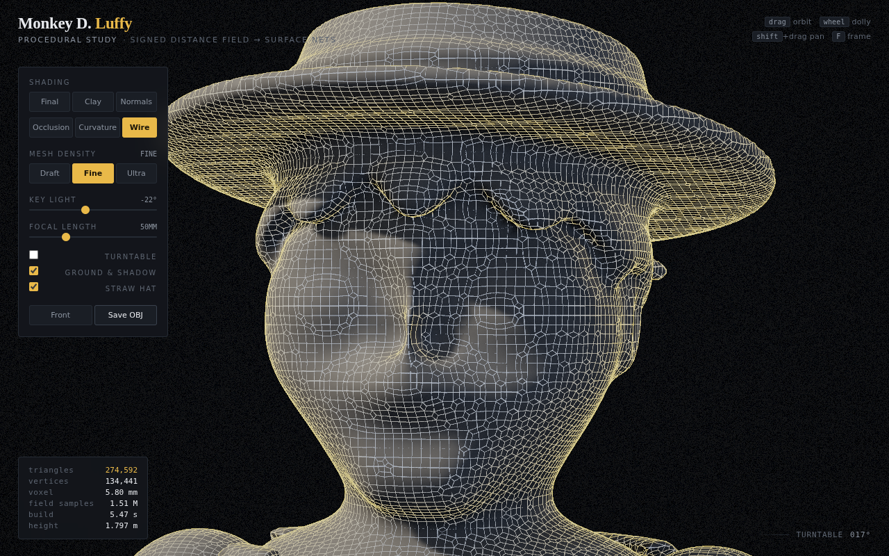
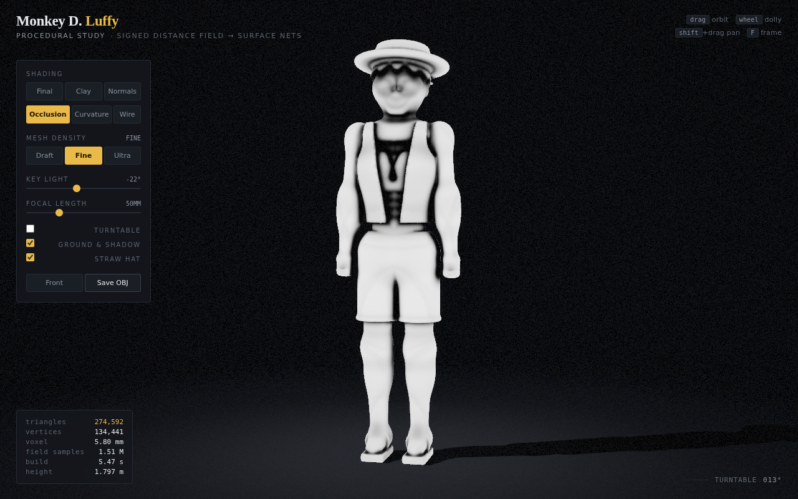
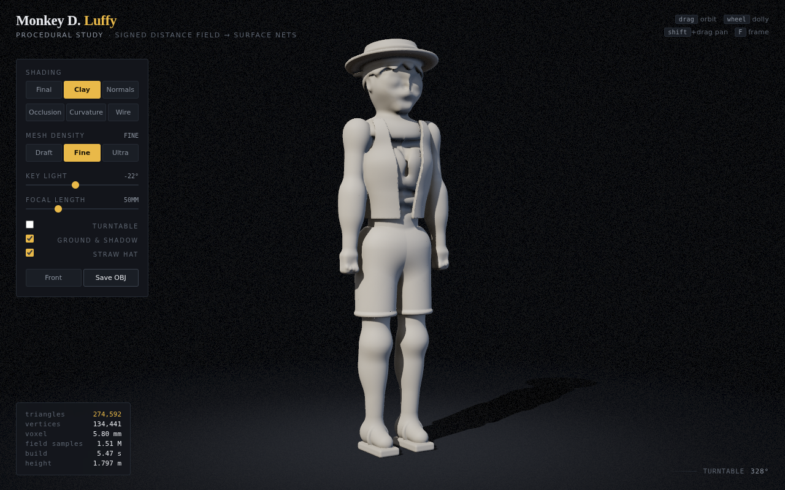

# Straw Hat Study

A single 3D model of Monkey D. Luffy, generated from scratch in the browser. No mesh
file, no sculpting software, no textures: the figure is defined as a signed distance
field in about 400 lines of arithmetic, polygonised on load, and rendered by a small
WebGL2 pipeline in the same file.



## Open it

```
open luffy-model/index.html       # macOS
xdg-open luffy-model/index.html   # Linux
```

Needs a WebGL2 browser. The default build takes a few seconds; the progress bar
tells you which stage it is in.

| Input | Action |
| --- | --- |
| drag | orbit |
| wheel | dolly |
| `shift` + drag | pan |
| `F` | frame the figure |
| `1`–`6` | Final · Clay · Normals · Occlusion · Curvature · Wire |

The rail on the left switches mesh density, swings the key light, changes focal
length, stops the turntable, hides the ground and takes the hat off. **Save OBJ**
writes the current mesh out with normals and per-vertex colours.



## How the model is defined

Every part of him is an equation. `sdSphere`, `sdEllipsoid`, a tapered round cone,
a torus and a rounded box return the signed distance from a point to that shape;
polynomial smooth minimum and maximum weld them together with a controllable
fillet, which is what makes a shoulder look like a shoulder instead of a ball
stuck on a tube.

He is built standing, 1.80 m to the top of the hat, facing +z, with the origin
between his soles. Everything above the collar is modelled at a canonical size and
then scaled and tilted about the base of the neck, so the head lands a shade under
seven heads tall — the proportion the character is actually drawn at — and sits at a
slight angle instead of staring dead ahead.

- **Body** — five stacked ellipsoids for the torso, with the sternum, two abdominal
  creases and the collarbones cut back in; limbs are tapered round cones with the
  joints tucked inside the silhouette. Arms and legs are mirrored through `|x|`, so
  one description builds both sides.
- **Head** — skull, jaw, chin, cheeks, brow ridge, nose and ears, blended in that
  order. The eyes are a shallow dish with a lens seated in it; the grin is a shallow
  depression carved in space that bends upward with `x`, so the mouth line sweeps up
  at the corners the way it is drawn.
- **Hair** — a shell around an inflated skull, cut along a hairline that rides high
  over the ears, drops to the nape at the back, and breaks into a five-point fringe
  over the brow.
- **Clothes** — the vest and the shorts are hollow shells of the body they sit on,
  clipped at the hem and cut open down the front; the sandals are a sole, a band
  that rings the instep and a thong between the toes.
- **The hat** — a drooping brim whose mid-surface falls away as the square of the
  radius, a shallow crown that sleeves down over the skull, and a red band, all
  built in its own frame and tipped back off the brow.

**The face is painted, not cut.** The eyes, brows, lips, teeth and the scar under
his left eye are decided per fragment from the world position, analytically
antialiased against the pixel footprint. They stay razor sharp no matter how coarse
the mesh is, and they cost nothing in triangles. The red band on the hat is painted
the same way: as a ring in the hat's own frame, so its edge is a line rather than a
staircase of whole vertices running across a curved brim.



## How the mesh is made

The field is polygonised by **dual contouring** over a block-sparse grid:

- Space is walked in blocks of 6³ cells. One distance query at a block's centre
  rejects it outright if the surface cannot reach inside — about 78% of blocks
  never get sampled at all.
- Each surviving block is filled with a 7³ patch of samples, and every cell with a
  sign change gets one vertex.
- That vertex is placed by solving the quadratic error function of the tangent
  planes at the cell's edge crossings. The trilinear interpolant of the eight
  corners supplies those normals for free — but it is blind to a crease running
  through the cell, which is exactly what the hair line, the hat brim and the hem
  of the vest are. Where the corner normals disagree, the real field is resampled
  around each crossing with a four-tap tetrahedral stencil that yields both the
  gradient and a Newton correction. The other ~90% of cells are smooth and cost
  nothing extra.
- Groups join with a 4 mm fillet rather than a hard union. A knife-edge crease is a
  feature no grid can resolve, and a mesher zigzags along it by half a cell.
- One constrained Laplacian pass relaxes each vertex toward its neighbours and
  pushes it straight back onto the isosurface along the gradient, so nothing
  shrinks or drifts.
- Every vertex then gets an analytic normal from the field gradient, ambient
  occlusion marched along that normal (each step normalised by its own radius, so
  thin shells do not go blotchy), the discrete Laplacian of the field as a
  curvature channel, and a material.

| Density | Voxel | Triangles | Field samples |
| --- | --- | --- | --- |
| Draft | 9.5 mm | ~105 k | 0.5 M |
| Fine | 5.8 mm | ~275 k | 1.5 M |
| Ultra | 4.2 mm | ~530 k | 2.9 M |

Where two parts meet the nearest-material test can flip from voxel to voxel — the
hair is trimmed to stop at the hat, so along that seam the two fields are within a
hair's breadth of each other. The hat carries a 2 mm advantage in that test, which
puts the boundary where one surface is unambiguously closer.



## How it is rendered

A forward pipeline, three-point studio lighting, everything in linear space and
tone mapped at the end.

- **Lights** — a warm key, a cool fill and a rim, all rotatable together from the
  rail. GGX specular with per-material roughness, wrapped diffuse so skin does not
  fall to black at the terminator, and a transmission term for light bleeding
  through backlit skin.
- **Shadows** — a 2048² depth map with hardware PCF, fitted to the figure; the
  ground disc takes a wider tap so the contact shadow stays soft.
- **Post** — a 4× MSAA half-float target, resolved, then a bright pass, a
  separable two-iteration bloom, ACES, a saturation lift, a vignette and a little
  grain.
- **Modes** — Final, Clay, Normals, Occlusion, Curvature and a quad wireframe drawn
  from the dual-contouring quads rather than the triangles.



## Notes

Unofficial, non-commercial fan work. One Piece and its characters are © Eiichiro
Oda / Shueisha. Nothing here is traced, imported or copied — the whole figure is
the arithmetic in `index.html`.
